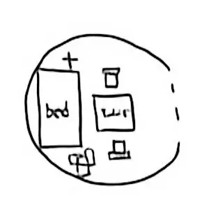

加密方法：在《新华字典（第12版）》中找到对应字，将页码和序号转化字母：

| 0                 | 1    | 2    | 3    | 4    | 5    | 6    | 7    | 8    | 9    |
| :---------------- | :--- | :--- | :--- | :--- | :--- | :--- | :--- | :--- | :--- |
| 空格（作句首时v） | b    | m    | d    | n    | g    | h    | q    | r    | c    |

| 10   | 11   | 12   | 13   | 14   | 15   | 16   | 17   | 18   | 19   |
| :--- | :--- | :--- | :--- | :--- | :--- | :--- | :--- | :--- | :--- |
| v    | a    | e    | f    | i    | j    | k    | l    | o    | p    |

| 20   | 21   | 22   |
| :--- | :--- | :--- |
| s    | t    | u    |

示例文本 -> 446-10, 292-3, 509-7, 021-1 -> nnhvmcmdg cq mbb.
            nnh-v , mcm-d, g c-q,  mb-b
