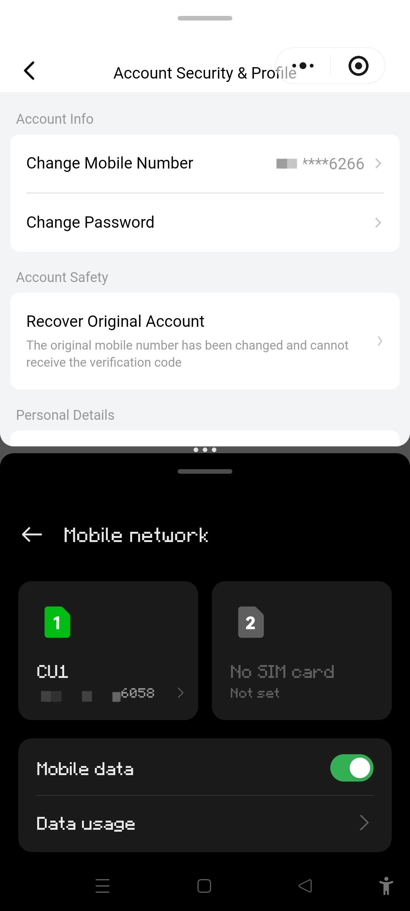
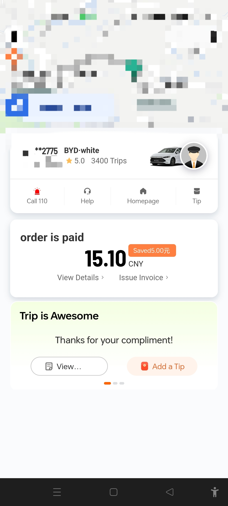

“到站了。”

司机轻轻把我拍醒。公交车已经到末站了——城西总站。

是不是最近玩《巴别塔圣歌》玩的？我起身。车里只有我和司机俩人了。下了车，打开手机一看，10点了，大概坐了一个小时吧。

坐车需要一个小时的话，那就在下午3点半动身回家吧。家里那边姐姐已经尽量做好伪装了，只要妈妈不打视频电话就没事。

城里就是不一样啊，看这堵成下水道一样的交通、眼花缭乱的路牌，和……等等，从这到朋友家有5公里？！

打电话问问，公交、地铁、打车哪个快。

“其实我是建议你打车的，我家……这个呃，不熟的很容易迷路。”

打开打车软件，注册新账号，还要我完善个人信息？昵称直接填通用网名，性别男，是兽人种，种族？这也要填？出生日期？？还有身高体重？？？

10块……都快够我买杯奶茶了……算了，还不是为了省事和省时间，我就不计较了。

“报下尾号。”

“6058。”

“6258是吧？”

司机手机：“尾号错误，请重新输入乘客手机尾号后四位。”

“是6058。”

“不对，‘62’对了。”

但我尾号确实是6058啊，“你把那个‘2’删了啊。”

“删不了的，说明这两位对了。”

“欸奇怪了，家里就没有人的手机尾号以‘62’开头啊。”我打开通讯录，输入“62”，“无结果”。“你看。”

“你是不是坐错车了？我的车牌号是2775。”

“没错啊，是2775。”

我胡乱地在手机里点来点去。

“6266。”

司机手机：“接到手机尾号6266的乘客。准备出发，全程大约5公里，预计需要8分钟。前方右转。”

我是在打车软件的个人信息页看到这个电话的。我把这个号码放到通话记录搜索里没有一条结果。嘶……好奇怪……

到了朋友家楼下，刚好撞见了同样来参加的同学。

“小区大门需要刷脸。我知道一个地方可以直接进去。”

然后他就带我来到了地下停车场。

“你也经常在地下停车场里探索吗？”

“地下停车场有啥好探索的？”

这里的门缝隙很大，只见他把手伸进去，按下开门键，门开了。

“那你是怎么知道这里能直接进的？”

“他告诉我的啊。”

呃，好吧。

“欢迎！”朋友一边开门一边招待我俩。

还挺热闹的，有大约10人，我认识的有5人，都是初中同学，那么其他人应该就是他的小学同学或附近的朋友了吧。

不过有一个也是兽人种欸，猫。

想起来了，他之前说过他小学班上有俩，是双胞胎。不过为啥就来了一个？

我们没有过多的交流，就各自坐着自顾自地玩手机。

不一会，另一只猫到了。也许有事去了？

“好了，人都到齐了。我们现在去饭店吃饭。”朋友和他爸领着我们来到楼下。

请点人数，刚好10人。朋友家有辆六菱宏光。我们上车，虽然超载了，且有点挤，还有仨兽人种，但能跑就是好车。

“其实……我本来不想说出来的。”

不知从哪里传来的讲话声，我们都很疑惑。

“但是我实在忍不了了……其实我对猫毛过敏……”

“你不早说！”

---

END OF SECTION 25.

部分内容根据真实事件改编。

WROTE AT 21:23, 07 AUG, 2026
COPYRIGHT 2026 XIAOLUOFOXINGTON
CC BY-SA 4.0