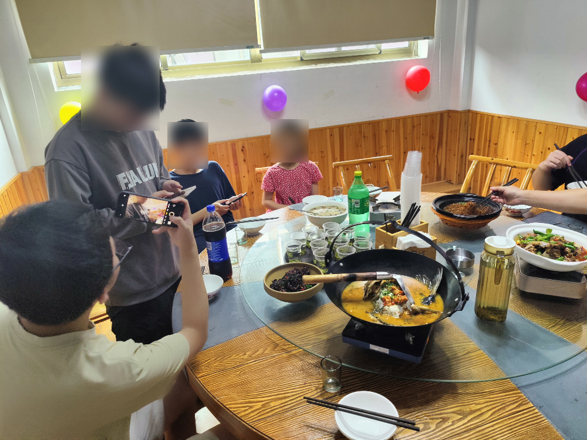

这个声音……是{MMGM}！我初中同学（我好像没和他说过我小学有两个猫兽人种呢）。

“抱歉啊，我不知道你对猫毛过敏。”我向后排大声喊话。

“有口罩嘛？”

“你座位上的那个屉子里应该有。”我爸对我说。

我打开副驾驶的屉子，在里面翻出来几只N95口罩。

“给你。”我说着，向后排递去。“你们帮忙递给{MMGM}。”

“谢谢。”

车子开了大约10分钟，我们到了一个大饭店。

我第一个下车。看着小小的面包车里下来10个人我自己都有点想笑，不知道被路人看见了会是什么反应。

包厢内，桌上已经提前摆好了10副碗筷，墙上也做了简单的装饰。我坐在里门最近的位置上，爸爸坐我右边。坐我左边的是从幼儿园到初中都和我同班的朋友。此外为了照顾{MMGM}，我们给他单开了一桌（虽然他夹菜还是要过来）。

简单拍一下照，我们就开吃了。

我已经提前想好了下午要怎么玩了——这么多人先来几把《三国杀》，然后联机打游戏，再然后去楼下逛，逛完吃蛋糕，之后就闲聊到晚饭！

一想到这些活动我就兴奋，饭都没怎么吃，饮料倒是喝了好几杯。

看看{LJPY}怎么样了，必须让他来羡慕羡慕。

“他这会估计在超市打工呢。”我初中的狐狸朋友开口了。

“那更得让他看看了，他在超市里打工，而我们待在空调房里喝着冰饮料爽吃。”

视频打过去，过了半分钟才接通。电话那边传来他的声音：“干啥呢，我准备去打暑假工……狐狸？还有……你们怎么都在？”

“今天我生日！所以我把他们请来我家玩了！”

“哦！对不起，我忘了，你给我发的消息我都没看！”

“没事，你现在可是一个打工人哪有时间参加我这个蔗民的世俗活动呀。”

全场一阵爆笑。

“你这暑假工咋样？”

“还行，下午2点上班，晚上8点下。还可以玩手机。只是一直站着有点累。”

“干啥？”

“守门，防止有些人没买单就出去。”

“门神哈哈哈……”

又一阵爆笑。

“行了，我先挂了。”

吃过午饭，回的我房间，我们如约开始玩《三国杀》（虽然走了一些人，但剩下的人还够）。

我们玩的是四人局，和我玩的都是一起就在一起玩的朋友。还是熟悉的感觉。我们玩了几局，但实在天有不测风云，又走了几个人。

现在算上我只有6人了，而他们都不怎么会玩《三国杀》。那《狼人杀》你们总会吧。

两狼三神，好奇怪的板子……我和那初中狐狸是狼？这法官故意的吧……什么叫一晚死3个人？

惊心动魄（并非）的桌游环节结束了。初中狐狸说他不喜欢玩网游，于是一旁自己玩手机去了。5个人，刚好组队玩《亡者农药》。

两点半了，差不多了。“走，我们出去逛！”

“去哪啊？”

“跟我来就知道了。”

“他睡着了。”

“那就不管他了。”

---

END OF SECTION 26.

WROTE AT 14:44, 19 AUG, 2026
COPYRIGHT 2026 XIAOLUOFOXINGTON
CC BY-SA 4.0