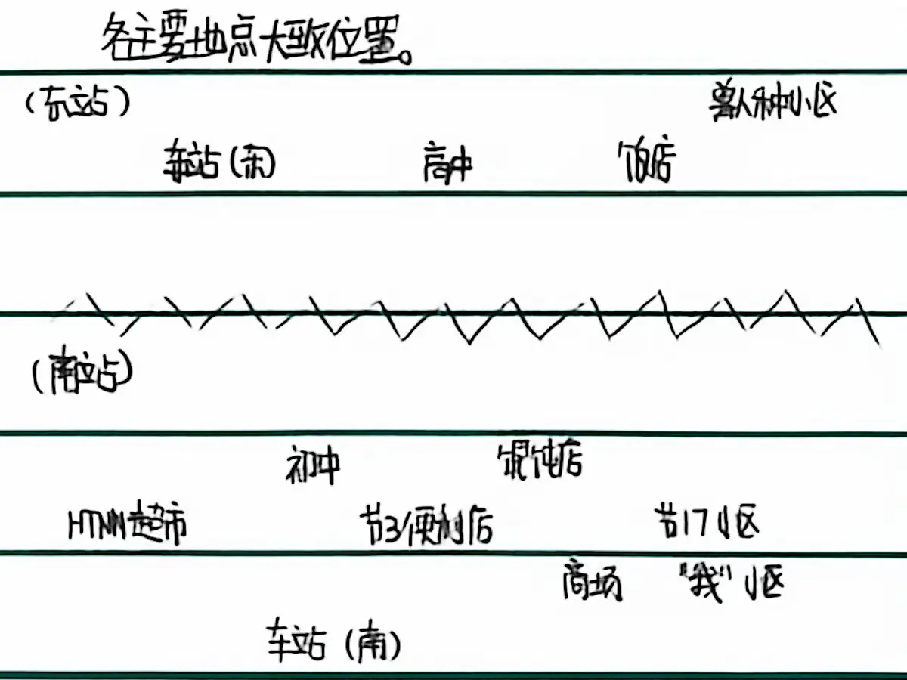

剧透警告！此节含有剧透内容！

又是我，洛狐XiaoluoFoxington。转眼间，这个小说已经写到第32节了啊。 ~~据完全不统计，，这应该是我更新时间最长的一个小说了。~~ 突然想起来了《史蒂夫冒险记：书名已存在》，这个更了有约2年了（虽然是断断续续的）。

总之，如你所见，这又是一节解析。我依旧会在这节里总结上文并规划下文。

这次到了神秘的7月9日，我考完期末考试回到家 ~~（我考了年级前20！）~~ *谁问你了？* 开始了一个愉快的暑假。不过在暑假里我也没忘记更新，由于在家里比在学校里有趣得多，所以我把更新频率降到了一周一节。

在暑假中我动不动就把小说扔给AI解析，几乎我能接触到的模型都试过了。也从中获得了很多有用的建议 ~~，当然更多的还是AI拍我彩虹屁提供的情绪价值~~ 。此外，我继续完善了小说的世界观。

世界观整体上还是和《Twin Dragons》差不太多的，加入了我自己的理解与改动。比如，译者“305寝”在翻译《Twin Dragons Wrold Guide》时翻译不同种类的兽人种称呼时翻译成了“x属兽人种”，说明兽人种不在人属之下的（我没找到原文，不知道这是译者的私货还是原文就是这样）。而我小说世界观中的兽人种是在人属之下的。

8月31日，收假了。可能是因为刚开学任务还比较轻，目前我的更新频率又回到了一天一节。不过随着任务的加重、剧情的复杂（？）和我的懒，后续肯定会降频率的。可能是两天一节？一周两节？还不确定。

接下来终于可以整理角色了。

对了，这些表都不是节16的补充，是重新整理的，且只有主要的，不全。

| K#   | 角色描述             | 其他绰号      | 全名   | 化名   | 网名   | 雌     | 种族 | 语言风格     | 首现 |
| :--- | :------------------- | :------------ | :----- | :----- | :----- | :----- | :--- | :----------- | :--- |
| 0    | “我”                 | 那狐狸（K#1） | {FN}   | {SN}   | {NN}   | <br /> | 狐   | <br />       | 1    |
| 1    | 朋友                 | 门神          | {LJPY} | <br /> | {LJPY} | <br /> | 人   | 口语化（？） | 1    |
| 2    | 馄饨店老板           | <br />        | <br /> | <br /> | <br /> | 是     | 人   | <br />       | 4    |
| 3    | K#0的姐姐            | <br />        | <br /> | <br /> | <br /> | 是     | 人   | <br />       | 14   |
| 4    | HTNN                 | <br />        | {HTNN} | <br /> | <br /> | <br /> | 熊   | <br />       | 14   |
| 5    | 7月5日生日的初中同学 | <br />        | {SRPY} | <br /> | <br /> | <br /> | 人   | 喜欢用括号   | 17   |
| 6    | 东站小饭店老板儿子   | <br />        | {FDPY} | <br /> | <br /> | <br /> | 犬   | <br />       | 31   |

精简掉一些不是很重要的角色后就剩这么一点了？！

没有回收的伏笔，已回收的就不整理了。

| F#   | 伏笔                          | 首现 |
| :--- | :---------------------------- | :--- |
| 0    | /（未结束）                   | 1    |
| 1    | - 暑假（未结束）              | 1    |
| 2    | - - K#1的妹妹想见K#0          | 5    |
| 3    | - - 节8                       | 8    |
| 4    | - - 掉毛                      | 22   |
| 5    | - - - HT上的帖子              | 22   |
| 6    | - - 节24                      | 24   |
| 7    | - - - 草帽                    | 24   |
| 8    | - - K#1的超市暑假工（未结束） | 26   |
| 9    | - - 充电棚里地理迷盒          | 30   |
| 10   | - - 搬去东站                  | 31   |
| 11   | - - K#6                       | 31   |

各节时间线，非写作时间。

凌-早-上-中-下-晚。

| 节   | 时间          | 节   | 时间     | 节   | 时间       | 节   | 时间       |
| :--- | :------------ | :--- | :------- | :--- | :--------- | :--- | :--------- |
| 1    | 6月30日早     | 9    | 5下      | 17   | 9下        | 25   | 15上\~15中 |
| 2    | 30上\~30晚    | 10   | 6晚      | 18   | 9晚\~10下  | 26   | 15中\~15下 |
| 3    | 7月1日早\~1中 | 11   | 6晚      | 19   | 10下\~11下 | 27   | 15下\~15晚 |
| 4    | 1上\~1中      | 12   | 6晚\~7凌 | 20   | 11下       | 28   | 16下\~16晚 |
| 5    | 2下\~4中      | 13   | 7凌      | 21   | 11下\~11晚 | 29   | 12下\~15下 |
| 6    | 4中\~4下      | 14   | 8晚      | 22   | 12晚       | 30   | 18凌\~18上 |
| 7    | 4晚\~5下      | 15   | 9下      | 23   | 13晚       | 31   | 22下\~22晚 |

各主要地点大致位置。

图片表示：



字符表示（建议使用等宽字体查看，单个普通空格=单个ASCII字符=半个汉字字符）：

``` 东站
                                      兽人种小区
车站（东）        高中      饭店
```

``` 南站
            初中        馄饨店
HTNN超市        节3便利店             节17小区
                              商场        “我”和K#1所在的小区
        车站（南）
```

``` 宽度测试（竖线对齐最佳）
123456789012345678|
XiaoluoFoxington--|
洛狐又又未命名小说|
```

如与纸质原稿冲突以此为准。

WROTE AT 20:07, 06 SEP, 2026
DIGITIZE AT 01:09, 12 SEP, 2026
COPYRIGHT 2026 XIAOLUOFOXINGTON
CC BY-SA 4.0