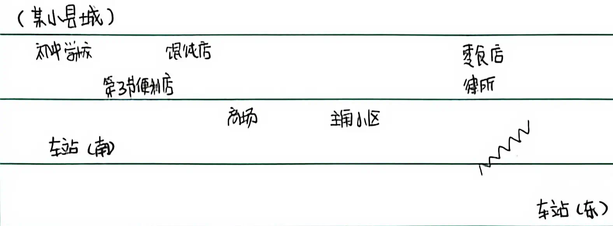

你好，我是洛狐XiaoluoFoxington，此小说的作者。这是一个番外。

我将在这里总结与反思前文，并规划后文方向。

在神秘的6月22日，我的月假结束并返校。在这个月假里我闲逛WildDream的时候无意间看到个感兴趣的搬运的漫画《Twin Dragons》，收假后意犹未尽，逐作此小说。

学校里计划7月8日期末考试，2天，考完就放暑假。我在6月22日开始写第1节，原本只是写着练手的，但在学校里太无聊了没事做，就给自己定下了一个更新频率：1天1节。我写这句话是是7月5日，按照更新频率来应该是第14节，说明有天多更了，可见我有多无聊了。

在学校里很封闭，没法发到网上，所以也就无法获得别人的反馈与建议。

直入正题吧，先整理一下角色。

| #   | 角色 | 全名 | 化名 | 网名 | 雌  | 种族 | 首次出现 | 重要性 |
| --- | ---- | ---- | ---- | ---- | --- | ---- | -------- | ------ |
| 1   | “我” | {FN} | {SN} | {NN} |     | 狐   | 1        | 高     |
| 2   | 朋友 |      |      |      |     | 人   | 1        | 高     |

只整理一些主要的吧，不然这表太长了。

目前还没有出现半个名字，我这小说写得好啊（（（

（在原稿的此处被夹死一只蚊子）

（续表）

| #   | 角色                   | 全名 | 化名 | 网名   | 雌  | 种族 | 首次出现 | 重要性 |
| --- | ---------------------- | ---- | ---- | ------ | --- | ---- | -------- | ------ |
| 3   | 没见过世面的便利店店员 |      |      |        |     | 人   | 3        | 低     |
| 4   | 馄饨店老板             |      |      |        | 是  | 人   | 4        | 中     |
| 5   | 朋友(#2)妹             |      |      |        | 是  | 人   | 5        | 低     |
| 6   | 村长                   |      |      |        |     | 猫   | 8        | 中     |
| 7   | 门口                   |      |      |        |     |      | 8        | 低     |
| 8   | 哨兵                   |      |      |        |     | 豹   | 8        | 低     |
| 9   | 地理迷盒发布者         |      |      |        |     | 人   | 2        | 中     |
| 10  | 姐姐                   |      |      |        | 是  | 人   | 14       | 中     |
| 11  | HybridTopia            |      |      | {HTNN} |     | 熊   | 14       | 中     |

差不多得了，接下来整理所有伏笔。

| #   | 伏笔                      | 首次出现 | 解决于 |
| --- | ------------------------- | -------- | ------ |
| 1   | 拿初中毕业证              | 1        | 3      |
| 2   | 奇怪空白纸条              | 2        | 12     |
| 3   | 角色#3后续反应            | 4        |        |
| 4   | 兽人种小区                | 4        |        |
| 5   | 暑假工                    | 5        | 10     |
| 6   | SpreadCraftLauncher下载站 | 5        | 15     |
| 7   | 角色#7想见角色#1          | 5        |        |
| 8   | 角色#1中暑晕倒            | 7        |        |
| 9   | 角色#2来角色#1家玩        | 10       | 14     |
| 10  | 角色#11的暑假工           | 15       |        |

地图。

---

WROTE AT 20:11, 05 JUL, 2026
COPYRIGHT 2026 XIAOLUOFOXINGTON
CC BY-SA 4.0